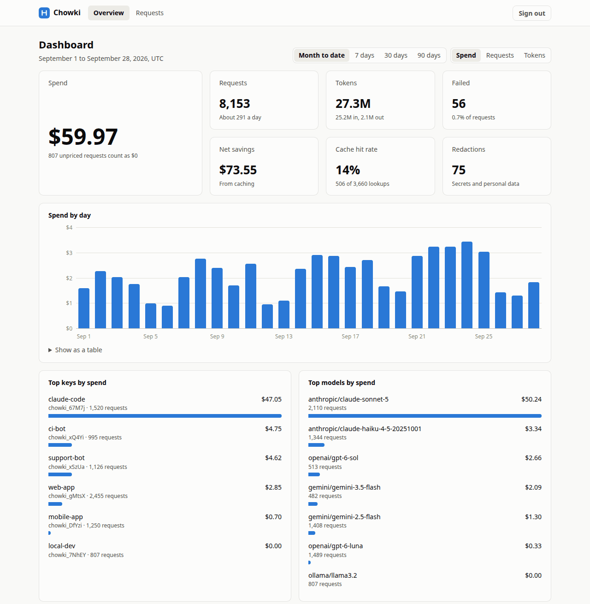

# Chowki

[](https://github.com/852hamza/chowki/actions/workflows/ci.yml)
[](https://github.com/852hamza/chowki/releases/latest)
[](LICENSE)
[](https://852hamza.github.io/chowki)

Chowki is an open-source AI gateway that you run yourself. Your apps, SDKs and coding agents send
their LLM traffic through one endpoint, and Chowki:

- **Saves tokens** with an exact response cache, provider prompt caching, and model aliases with
  fallback.
- **Keeps secrets in**: virtual keys instead of shared provider keys, and redaction of secrets and
  personal data before a prompt leaves your network.
- **Controls spend** with budgets and rate limits for every key and project.
- **Reports honest numbers**: usage, cost and savings per key, project and model, from official
  prices, with the method of every saving.

It speaks the OpenAI, Anthropic and Google Gemini APIs, and works with any OpenAI-compatible
provider, including local models in Ollama. Clients change only their base URL and key. Chowki is
one Go binary with a SQLite database.



*Chowki* (چوکی) means "checkpoint" in Urdu.

## Quickstart

Install the latest release on Linux or macOS:

```sh
curl -fsSL https://github.com/852hamza/chowki/raw/main/install.sh | sh
```

Set up a folder for the gateway, give it your provider key, create a virtual key, and start it:

```sh
mkdir ~/chowki-gateway && cd ~/chowki-gateway
chowki init
echo 'OPENAI_API_KEY=<OPENAI_API_KEY>' > .env && chmod 600 .env
chowki key create --name my-app
chowki serve
```

Replace `<OPENAI_API_KEY>` with your key. [Send your first request](docs/get-started/quickstart.md)
walks through each step and a first request, in about five minutes. To run Chowki with Docker
Compose, or to build it from source, see [Install Chowki](docs/get-started/install.md).

## Connect your tools

`chowki setup` prints the settings that connect a tool or SDK to the gateway:

```sh
chowki setup claude-code
```

It knows `claude-code`, `codex`, `gemini-cli`, `openai-sdk`, `anthropic-sdk`, `google-genai-sdk`
and `ollama`. Any other tool that takes an OpenAI-compatible base URL connects with
`http://localhost:8080/v1` and a virtual key, and reaches Anthropic and Gemini models as well.

## Documentation

The guide is at **[852hamza.github.io/chowki](https://852hamza.github.io/chowki)**.

- **Get started:** [Send your first request](docs/get-started/quickstart.md) ·
  [Install Chowki](docs/get-started/install.md)
- **Keys and spend:** [Manage virtual keys](docs/how-to/manage-virtual-keys.md) ·
  [Store provider keys](docs/how-to/manage-provider-keys.md) ·
  [Set budgets](docs/how-to/set-budgets.md) · [Set rate limits](docs/how-to/set-rate-limits.md) ·
  [Use the dashboard](docs/how-to/use-the-dashboard.md) ·
  [Report usage and cost](docs/how-to/report-usage.md)
- **Save tokens:** [Cache responses](docs/how-to/cache-responses.md) ·
  [Use Anthropic prompt caching](docs/how-to/anthropic-prompt-caching.md) ·
  [Route requests with aliases and fallback](docs/how-to/routing-and-fallback.md)
- **Protect data:** [Redact secrets and personal data](docs/how-to/redact-sensitive-data.md) ·
  [Scan for secrets](docs/how-to/scan-for-secrets.md) ·
  [Security model](docs/concepts/security.md)
- **Providers and tools:** [Use Google Gemini](docs/how-to/use-google-gemini.md) ·
  [Call any model with OpenAI SDKs][openai-sdks] ·
  [Connect OpenAI-compatible providers](docs/how-to/connect-openai-compatible-providers.md) ·
  [Use local models with Ollama](docs/how-to/use-local-models-with-ollama.md) ·
  [Connect Claude Code](docs/how-to/connect-claude-code.md) ·
  [the Codex CLI](docs/how-to/connect-codex.md) ·
  [the Gemini CLI](docs/how-to/connect-gemini-cli.md) · [the SDKs](docs/how-to/connect-sdks.md)
- **Operate:** [Check your setup](docs/how-to/check-your-setup.md) ·
  [Serve over HTTPS](docs/how-to/serve-over-https.md) ·
  [Monitor Chowki](docs/operations/monitoring.md) ·
  [Back up and restore](docs/operations/backup-and-restore.md) ·
  [Upgrade](docs/operations/upgrade.md) · [Measure the overhead](docs/operations/performance.md)
- **Reference:** [API](docs/reference/api.md) · [CLI](docs/reference/cli.md) ·
  [Admin API](docs/reference/admin-api.md) · [Configuration](docs/reference/configuration.md)
- **Understand and contribute:** [Architecture](docs/concepts/architecture.md) ·
  [How Chowki computes cost and savings](docs/concepts/savings-methodology.md) ·
  [Development setup](docs/contributing/development-setup.md) ·
  [Code structure](docs/contributing/code-structure.md) ·
  [Release Chowki](docs/contributing/releasing.md) ·
  [Architecture decision records](docs/adr/)

## Status

Chowki is at v0.2. Before v1.0, a minor release can change the configuration or the APIs; the
[changelog](CHANGELOG.md) says what changed and how to upgrade.

## Contributing

Contributions are welcome. Read [CONTRIBUTING.md](CONTRIBUTING.md) to learn how to propose a
change, and follow the [code of conduct](CODE_OF_CONDUCT.md). To report a vulnerability, see
[SECURITY.md](SECURITY.md).

## License

Chowki is licensed under the [Apache License 2.0](LICENSE).

[openai-sdks]: docs/how-to/call-any-model-with-openai-sdks.md
