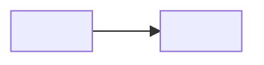

<Two or three sentences: what this is and why it matters to the reader.>

## How it works
<Explanation in plain language. Add a Mermaid diagram when it helps, with a text summary right after it.>

## Key terms
| Term | Meaning |
|---|---|
| <Term> | <Definition> |

## Design choices and trade-offs
- <Why it works this way, and what that means for the reader>

## Limits
- <Known limits, with numbers>

## Related
- <How-to pages that apply this concept> · <Reference pages>
