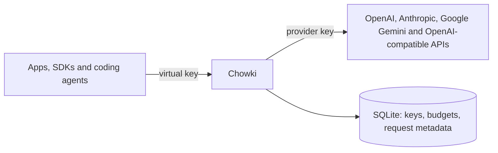
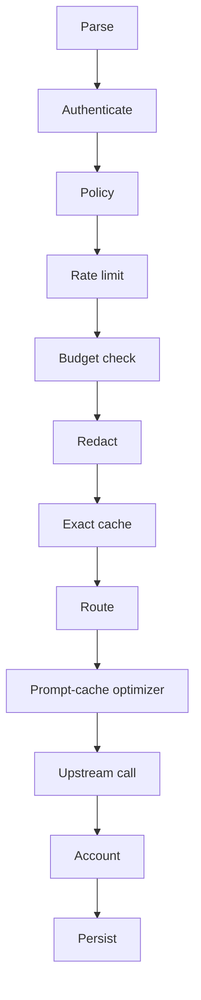

Chowki is a gateway between your applications and LLM providers. Every request passes the same
checks, so keys, budgets, redaction and cost reports apply to all of your AI traffic in one place.

> **Note:** Chowki is in early development. This page describes the design of the first release;
> the [changelog](https://github.com/852hamza/chowki/blob/main/CHANGELOG.md) shows which parts exist.

## How it works

Your applications, SDKs and coding agents change two settings: the base URL, which points at
Chowki, and the API key, which becomes a Chowki virtual key. Chowki checks each request, forwards it
to a provider with the provider key, streams the answer back, and records usage and cost.

Clients authenticate to Chowki with virtual keys. Only Chowki holds the provider keys, encrypted,
and it stores request metadata in SQLite.

### API families

Chowki serves each API family under its own base URL, so SDKs work without code changes:

| Your client speaks | Base URL on Chowki | Reaches |
|---|---|---|
| OpenAI format | `/v1` | Any OpenAI-compatible provider, and Anthropic and Gemini models through translation |
| Anthropic format | `/anthropic` | Anthropic |
| Gemini format | `/gemini` | Google Gemini |

Clients send the virtual key in the header their SDK already uses: `Authorization: Bearer`,
`x-api-key` or `x-goog-api-key`.

### Request pipeline

Each request passes these stages in order:

1. **Parse**: enforce the body size limit and detect the API family from the path.
2. **Authenticate**: verify the virtual key and reject revoked keys.
3. **Policy**: check the models and endpoints that the key may use.
4. **Rate limit**: enforce requests and tokens per minute for the key.
5. **Budget check**: reject the request when the key has used up its budget.
6. **Redact**: find secrets and personal data, then mask them, block the request or raise an alert,
   depending on the policy.
7. **Exact cache**: for a non-streaming request identical to an earlier one, return the stored
   response. The cache is opt-in.
8. **Route**: resolve an alias, such as `fast`, to a provider and model.
9. **Prompt-cache optimizer**: for Anthropic, mark stable prompt prefixes, so that repeated
   prefixes cost less.
10. **Upstream call**: call the provider with the provider key and a timeout, and relay a streamed
    answer chunk by chunk.
11. **Account**: read the token usage that the provider reported, and compute cost and savings.
12. **Persist**: save the request metadata and update spend and metrics.

When Chowki rejects a request, it answers in the error format of the API family that you called,
so your SDK shows the error correctly.

## Key terms

| Term | Meaning |
|---|---|
| Virtual key | A key that Chowki issues to a person or an application. Chowki stores only its SHA-256 hash. |
| Provider key | The key of your account with a provider. Only Chowki holds it, encrypted with AES-256-GCM. |
| Alias | A model name, such as `fast`, that Chowki resolves to one or more provider models in fallback order |
| API family | The request format that a client speaks: OpenAI, Anthropic or Gemini |
| Project | A group of virtual keys |

## Design choices and trade-offs

- **One binary with SQLite.** You install one file or run one container image, with no database
  server. See [ADR 0002](../adr/0002-go-single-binary-sqlite.md).
- **Metadata, not content.** Chowki stores request metadata, such as the model, token counts and
  cost, but not prompts or responses. The one exception is the response cache, which is opt-in and
  encrypted.
- **Pass-through by default.** Chowki forwards a request unchanged unless a feature must change it,
  so provider prompt caching and streaming keep working.
- **Fallback before the first byte.** When a provider fails with a rate limit, a server error or a
  timeout, Chowki tries the next target of an alias, but only before any part of the answer has
  reached your client.
- **Honest numbers.** Cost and savings come from the token usage that providers report. When a
  provider reports no usage, Chowki records the tokens as unknown instead of guessing.
- **Low overhead.** The target for Chowki's own overhead, without the provider's time, is under
  5 ms at the median and under 25 ms at the 99th percentile.

## Limits

- The first release runs as one node: rate limits are kept in memory, and SQLite allows one writer.
- The exact cache serves only non-streaming requests.
- The prompt-cache optimizer works only with Anthropic. OpenAI caches prompts automatically, and
  Chowki keeps requests byte-stable so that this caching keeps working.

## Related

- [Code structure](../contributing/code-structure.md) ·
  [Set up a development environment](../contributing/development-setup.md) ·
  [Architecture decision records](../adr/)
