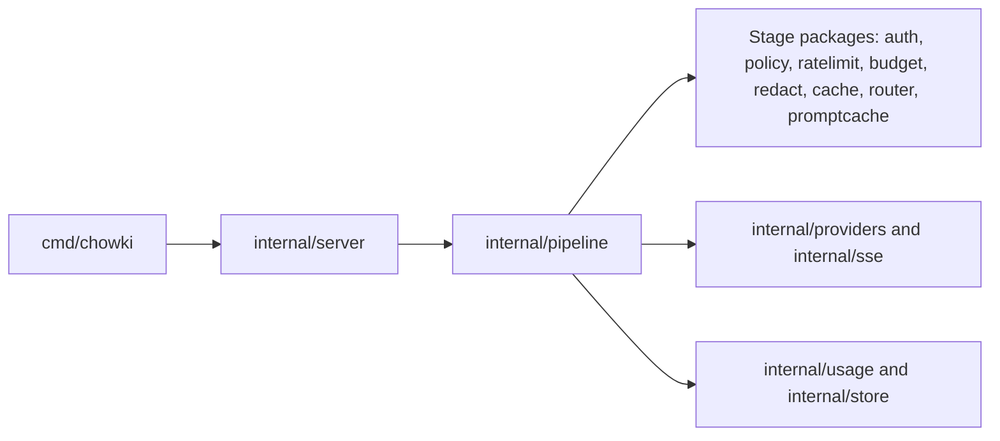

Chowki is one Go module that builds one binary, `chowki`. This page shows where each part of the
gateway lives, so that you know where a change belongs and which package to test.

## How it works

`cmd/chowki` holds the command, which starts the HTTP server or runs a CLI subcommand. Almost all
other code lives in small packages under `internal/`. Each package handles one stage of a request
or one supporting service, and its `doc.go` states its purpose. Go doesn't let other modules import
`internal/` packages, so they can change freely between releases. The only public Go API is
`pkg/plugin`.

The command starts the server. The server hands each request to the pipeline, which runs the stage
packages in order, calls the provider through an adapter, and records the usage.

## Repository layout

| Path | Contents |
|---|---|
| `cmd/chowki/` | The `chowki` command: HTTP server and CLI subcommands |
| `internal/server/` | HTTP server, middleware, graceful shutdown and error responses |
| `internal/pipeline/` | Runs the request stages in order |
| `internal/auth/` | Virtual keys: generate, hash and verify |
| `internal/policy/` | Models and endpoints that each virtual key may use |
| `internal/ratelimit/` | Limits on requests and tokens per minute |
| `internal/budget/` | Spend tracking and budget enforcement |
| `internal/redact/` | Detection and masking of secrets and personal data |
| `internal/cache/` | Encrypted exact-match response cache |
| `internal/promptcache/` | Anthropic prompt-cache optimizer |
| `internal/router/` | Aliases, provider selection and fallback |
| `internal/providers/` | Adapters for OpenAI-compatible APIs, Anthropic and Google Gemini |
| `internal/translate/` | Conversion between the OpenAI format and the Anthropic and Gemini formats |
| `internal/sse/` | Parsing and relaying of server-sent event streams |
| `internal/usage/` | Token usage, cost and savings |
| `internal/catalog/` | Model catalog: capabilities and prices |
| `internal/store/` | Storage interface, SQLite implementation and migrations |
| `internal/secretbox/` | Encryption of provider keys and cache entries |
| `internal/scan/` | Secret scanner for repositories, `.env` files and MCP configurations |
| `internal/admin/` | Admin JSON API |
| `internal/web/` | Dashboard |
| `internal/metrics/` | Prometheus metrics endpoint |
| `internal/config/` | Configuration loading and validation |
| `internal/buildinfo/` | Version and project identity of the build |
| `internal/testutil/` | Test helpers, including the fake providers |
| `pkg/plugin/` | Public, stable interfaces for extensions |
| `tools/projectsync/` | The tool behind `make sync` and `make sync-check` |
| `tools/commitcheck/` | The CI check of commit messages and sign-offs |
| `docs/` | This developer guide and the architecture decision records |

## Key terms

| Term | Meaning |
|---|---|
| Stage | One step of the request pipeline, such as authentication or the exact cache |
| Adapter | The code that calls one provider API |
| Fake provider | A test server in `internal/testutil` that answers like a provider API, with the reply and token usage that the test sets |
| Project identity | The project domain, GitHub owner and repository name, kept in `project.env` |

## Design choices and trade-offs

- **Standard library first.** Chowki depends on as few modules as possible, and only on modules with
  free, permissive licenses. Each dependency has an [architecture decision record](../adr/) that
  explains why the standard library isn't enough.
- **One package per stage.** Each stage takes a clear input and returns a clear output, so you can
  test it on its own with table-driven tests.
- **Fake providers instead of real ones.** Tests run offline, cost nothing and give the same result
  every time. The fakes follow each provider's documented format, and their own tests check it.
- **Project identity in one file.** `project.env` holds the domain, GitHub owner and repository
  name. Go code reads them from `internal/buildinfo`. When they change, `make sync` rewrites the
  module path, imports and docs. `make sync-check` runs in CI and fails if a Go file outside
  `internal/buildinfo` contains the domain or a project URL.

## Limits

- Most packages under `internal/` contain only their `doc.go` until their feature is built.
- `make sync` needs a Git work tree, because it asks Git which files belong to the repository.

## Related

- [Set up a development environment](development-setup.md) ·
  [Architecture](../concepts/architecture.md)
